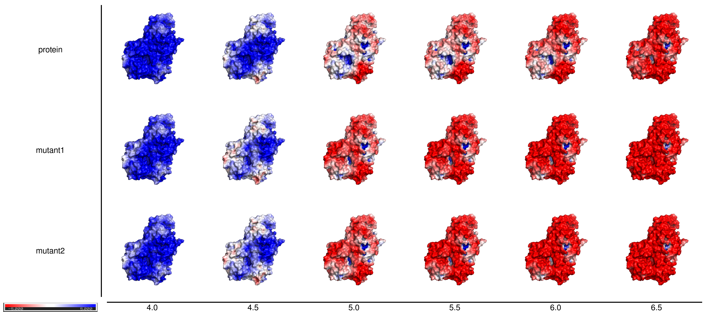
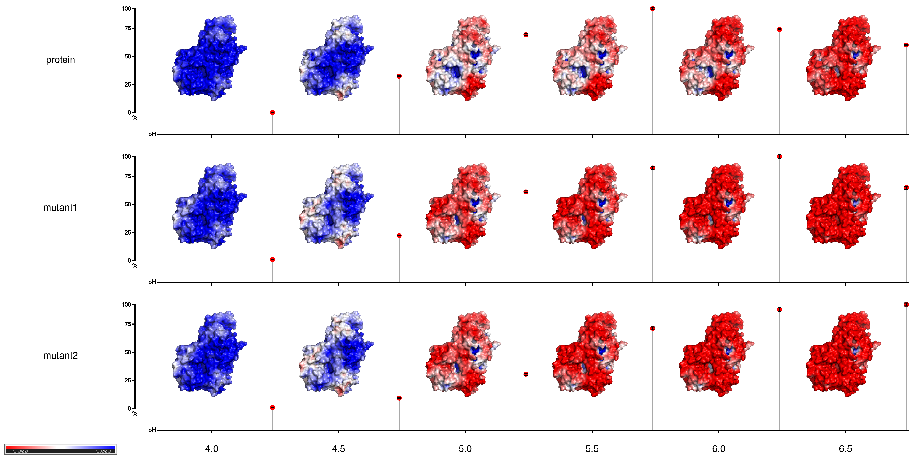

# pHmap
Software for generating a surface charge based pH-profile map.

Optionally activity data can be visualised as lollipop bars.

## Requirements

- [PDB2PQR](http://www.poissonboltzmann.org/) - for calculation of protonation states
- [ABPS](http://www.poissonboltzmann.org/) - for calculation of electrostatic surface
- [PyMol](https://github.com/schrodinger/pymol-open-source) - for generating surface visualization and .pngs
- [ImageMagick](https://imagemagick.org/) - for generating final multi .png picture
- [Argbash](https://argbash.readthedocs.io/en/latest/index.html) (argument parser generator)

Citation

> Breslmayr, E., pHmap, (2021), GitHub repository, https://github.com/riccstick/pHmap

## Installation

- Tested under Ubuntu_20, Ubuntu_16 and MacOSx_Catalina_10.15.7
- Programs: APBS_v3.0.0; pdb2pqr_v2.1.1; pymol_v2.3 & v2.4; ImageMagick 6.9.7-4 Q16 x86_64 & 7.0.10-45 Q16 x86_64

### SourceCode compiling

- Template file can be changed and converted to executable code (tested with argbash_2.10)

  `argbash pHmap.template -o pHmap`

 - Completion file add to `/etc/bash_completion.d/`

  `argbash pHmap.template --type completion --strip all -o pHmap.m4`

- Required programs have to be in executable paths

### PDB2PQR

- Download from Github: [pdb2pqr_2.1.1](https://github.com/Electrostatics/pdb2pqr/releases/tag/v2.1.1)
- [Install](https://erikbreslmayr.medium.com/installing-pre-compiled-apbs-for-electrostatic-surface-and-pdb2pqr-for-protonation-state-15fd068574b9)

### ABPS

- Download from Github: [ABTS_v3.0.0](https://github.com/Electrostatics/apbs/releases/tag/v3.0.0)
- [Install](https://erikbreslmayr.medium.com/installing-pre-compiled-apbs-for-electrostatic-surface-and-pdb2pqr-for-protonation-state-15fd068574b9)

### PyMol

- Open Source PyMol v2.x
- Ubuntu

> `sudo apt install pymol`

  - Mac

> `brew install brewsci/bio/pymol`

### ImageMagick

- Ubuntu

> `sudo apt-get install imagemagick`
>
> -  Mac

> `brew install imagemagick` 

- [Commands](https://imagemagick.org/script/command-line-options.php#fill)