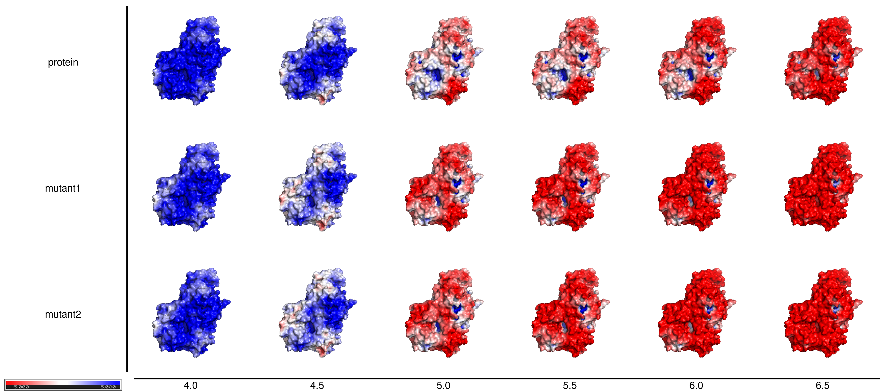

# pHmap

pHmap generates ordered maps of pH-dependent protein electrostatic surface
potential. Protein protonation is prepared with PDB2PQR/PROPKA, electrostatic
potential is calculated by APBS, surfaces are rendered by PyMOL, and the final
figure is composed in Python.



The repository is being migrated from the original Bash program to a local,
testable Python application. The first Python vertical slice supports one or
more PDB files, explicit pH values or an inclusive pH range, an optional
validated PyMOL camera view, deterministic rendering order, isolated run
directories, and a complete JSON provenance manifest.

## Local quick start

The complete scientific workflow needs Python 3.11+, PDB2PQR 3.7.x, APBS
3.4.1, and PyMOL Open Source. On Apple Silicon macOS, the supported development
environment is described by `pixi.toml`:

```console
pixi install
pixi run doctor
pixi run test
```

Validate the repository's two-pH smoke input without launching scientific
programs:

```console
pixi run validate-smoke
```

Run the initial end-to-end workflow:

```console
pixi run smoke
```

The equivalent direct command is:

```console
phmap run example/mutant2.pdb \
  --ph 5.0 \
  --ph 7.0 \
  --view example/set_view.txt
```

Every run is confined to its own directory:

```text
runs/<run-id>/
├── manifest.json
├── inputs/
├── work/<protein-id>/<ph>/
├── logs/<protein-id>/<ph>/
├── renders/<protein-id>/
└── output/pHmap.png
```

Without `--output-dir`, each invocation creates a unique timestamped run. An
existing run directory is never overwritten implicitly. Failed scientific
commands stop the workflow, preserve their logs, and mark the manifest as
failed.

See [the development guide](docs/development.md) for environment details,
baseline policy, and current limitations.

## Python-only development

If compatible PDB2PQR, APBS, and PyMOL executables are already available on
`PATH`, the Python project can also be installed with uv:

```console
uv sync --group dev
uv run phmap doctor
uv run pytest
```

`uv` does not install the APBS or PyMOL native programs; use the Pixi
environment for the complete supported local toolchain.

## Current scope

Implemented in the first migration milestone:

- strict PDB, pH range/list, ligand-path, and 18-value camera validation;
- modern PDB2PQR, APBS, and headless PyMOL subprocess adapters;
- deterministic multi-protein/pH ordering;
- checked outputs, per-cell logs, tool-version capture, and input/output hashes;
- a Python-native PNG grid and potential legend; and
- unit and fake-backend integration tests that do not need the scientific tools.

Activity lollipops, the legacy styling surface, cache-based selective reruns,
and a local graphical interface are subsequent migration stages. The Bash and
Script Server files remain temporarily as a feature and visual reference; they
are not the implementation base for the Python workflow.

## Scientific reproducibility

The two historical PNGs are visual references, not numerical goldens: they do
not contain a complete record of tool versions or APBS/PDB2PQR parameters. A
new accepted baseline should retain the environment lock, manifest, PQR files,
APBS inputs, DX maps, logs, tiles, and final figure. Numerical artifacts should
be reviewed before tolerant visual comparison.

## Citation

Breslmayr, E. (2021). *pHmap - A tool for automatized calculation and
visualization of protein surface charge pH-profiles* (Version v1.2). Zenodo.
<https://doi.org/10.5281/zenodo.4751499>

[](https://zenodo.org/badge/latestdoi/308921470)

## License

[MIT](LICENSE)
