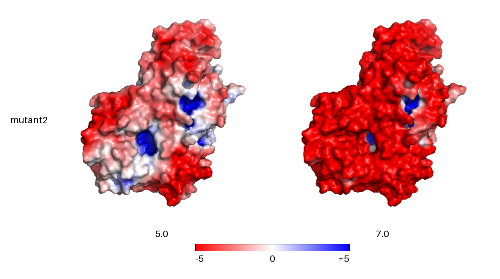

# Protein pH maps, made locally

pHmap calculates and visualizes how a protein's electrostatic surface potential
changes across pH values. It combines PDB2PQR/PROPKA, APBS, PyMOL, and a Python
renderer in a workflow that runs on your computer.

Use the desktop launcher or local browser interface for a graphical workflow,
or keep using the command line for scripts and batch calculations. Both run the
same calculation pipeline. Protein files and results stay on your computer.

## Start here

- [Download pHmap](downloads.md) for macOS, Windows, or Linux.
- Follow the [tutorial](tutorial.md) to run a pH range for one or more proteins.
- See the [release guide](releases.md) for first-run setup and troubleshooting.

The desktop app installs its scientific tools the first time it starts, so an
internet connection is needed for that initial setup. Later calculations can
run without that download step. The command-line interface remains available
in a development environment; see [local development](development.md).

## What it does

Given one or more PDB files and pH values, pHmap prepares protonation states,
calculates electrostatic potentials, renders protein surfaces, and assembles
the resulting panels into an ordered image. Each run keeps its logs,
intermediate scientific files, output, and a provenance manifest together.

The [feature roadmap](feature-roadmap.md) describes current capabilities and
planned additions.
